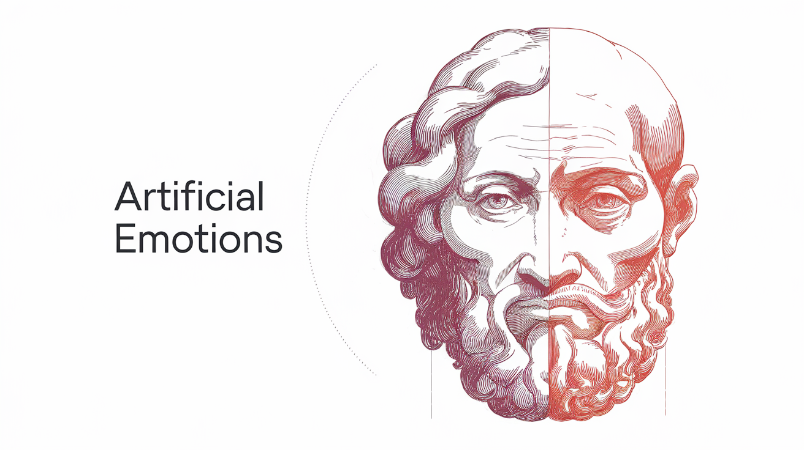

# Artificial Emotion Framework (AEF): Designing Affect for Intelligent Systems

## Abstract

Contemporary AI systems excel in cognitive tasks but often lack the nuanced understanding and adaptive responses characteristic of affective systems. This paper proposes a novel framework for *artificial emotions*, moving beyond mere simulation of human emotions towards the development of adaptive affective mechanisms that enhance AI capabilities. We argue that artificial emotions should be designed to serve specific functional roles within AI systems, improving adaptability, learning, decision-making, and human-AI interaction. Our framework introduces *latent emotion spaces*—vector representations of emotions that influence other AI systems, such as Large Language Models (LLMs). These emotion spaces are coupled with attached memories, intensity modulation based on contextual factors, time-based decay, and mechanisms for resolving conflicting emotions. Crucially, our framework allows for the redefinition of existing emotions and the creation of entirely new ones tailored to an AI's specific needs and operational context, fostering mutualistic human-AI relationships and enhancing realism in simulations.

## 1. Introduction

While artificial intelligence has achieved remarkable progress in areas like natural language processing and computer vision, the incorporation of affective computing—the study and development of systems that can recognize, interpret, and respond to human emotions—remains a significant challenge. Current approaches often focus on recognizing and simulating human emotions, which, while valuable, may not be the most effective way to imbue AI with affective capabilities. We propose a shift towards *artificial emotions*: affective states designed not to mimic human experience but to serve specific functional roles within AI systems, enhancing their adaptability, learning, and interaction with both humans and their environment.

We argue that artificial emotions should be treated as adaptive mechanisms that allow AI to:

*   **Prioritize Information:** Focus attention on relevant information based on affective state.
*   **Modulate Learning:** Influence learning rates and memory retention based on emotional valence.
*   **Guide Decision-Making:** Bias choices based on the current affective state.
*   **Improve Human-AI Interaction:** Foster more natural and intuitive communication.

Our framework utilizes *latent emotion spaces*, vector representations of emotions that possess the following key characteristics:

*   **Attached Memories:** Each emotion is linked to specific memories or experiences, allowing the AI to learn from past affective responses and associate emotions with particular contexts.
*   **Intensity Modulation:** The intensity of an emotion is dynamically adjusted based on contextual factors, the strength of associated memories, and external stimuli.
*   **Time-Based Decay:** Emotions decay over time if not reinforced, mirroring the transient nature of affective states in humans and preventing the AI from being perpetually stuck in a single emotional state.
*   **Conflict Resolution:** Mechanisms are implemented to handle situations where multiple emotions are activated simultaneously, enabling the AI to prioritize or reconcile conflicting affective responses.

This framework allows for the creation of mutualistic human-AI relationships by designing artificial emotions that complement human affective responses, promoting more empathetic and effective collaboration. Furthermore, it offers a powerful tool for enhancing the realism of AI simulations by providing a more nuanced and dynamic model of emotional behavior.

## 2. Related Work

Existing research in affective computing encompasses several key areas:

*   **Emotion Recognition:** Focuses on detecting and classifying human emotions from various modalities, such as facial expressions, speech patterns, physiological signals, and text.
*   **Emotion Synthesis/Simulation:** Aims to create AI systems that can exhibit human-like emotional expressions and behaviors, often using rule-based systems, machine learning models, or virtual characters.
*   **Cognitive Architectures with Affect:** Explores the integration of affective components into cognitive architectures, such as the SOAR cognitive architecture, to model the interplay between cognition and emotion.

Our work differs from these approaches by focusing on the *design and engineering* of artificial emotions for functional purposes within AI systems, rather than solely on replicating human emotions.

## 3. The Latent Emotion Space Framework

Our framework represents artificial emotions using *latent emotion spaces*, high-dimensional vector spaces where each dimension corresponds to a specific aspect or component of an emotion.

### 3.1 Emotion Representation

Each emotion *E* is represented as a vector within this space. For example, in a simplified 3-dimensional space, an emotion like "curiosity" might be represented as *Ecuriosity = (high exploration, low fear, medium anticipation)*.

### 3.2 Memory Association

Each emotion vector *E* is associated with a set of memories *M*. These memories can be represented as embeddings, symbolic representations, or other suitable data structures. The association between an emotion and a memory is represented by a weight, indicating the strength of the connection. When a memory is activated, it contributes to the activation of its associated emotions.

### 3.3 Intensity Modulation

The intensity of an emotion is not fixed but is dynamically modulated based on several factors:

*   **Memory Activation:** The activation level of associated memories directly influences emotion intensity. Stronger memory activation leads to higher emotion intensity.
*   **Contextual Factors:** External stimuli or contextual cues can modulate emotion intensity. For example, a "fear" emotion might be intensified in a dangerous environment.
*   **Internal State:** The AI's internal state (e.g., its goals, current task) can also influence emotion intensity.

### 3.4 Time-Based Decay

Emotions decay over time if not reinforced by new stimuli or memory activations. This decay prevents the AI from remaining in a single emotional state indefinitely. The rate of decay can be adjusted based on the specific emotion and the AI's architecture.

### 3.5 Conflict Resolution

When multiple emotions are activated simultaneously, conflicts can arise. We propose several mechanisms for conflict resolution:

*   **Dominance Hierarchy:** Some emotions may be inherently dominant over others. For example, a "fear" emotion might override a "curiosity" emotion in a dangerous situation.
*   **Contextual Prioritization:** The current context or task may prioritize certain emotions.
*   **Weighted Averaging/Blending:** The emotion vectors can be combined using a weighted average based on their intensities, resulting in a blended emotional state.

### 3.6 Influence on Other AI Systems (LLMs)

The emotion vector *E* can influence other AI systems, such as LLMs, in several ways:

*   **Embedding Modulation:** The emotion vector can be added to or concatenated with the input embeddings of the LLM, influencing its understanding of the input context.
*   **Attention Biasing:** The emotion vector can be used to adjust the attention weights within the LLM, directing its focus to specific parts of the input or influencing its generation process.
*   **Prompt Engineering:** Emotional cues derived from the emotion vector can be incorporated into the prompt given to the LLM, guiding its output.

## 4. Redefining and Creating Emotions

A key aspect of our framework is the ability to redefine existing emotions and create entirely new ones. This can be achieved by manipulating the emotion vector within the latent space, adjusting memory associations, and modifying the intensity functions. This flexibility allows AI systems to develop affective responses tailored to their specific needs and operational context.

## 5. Mutualistic Human-AI Relationships

By carefully designing artificial emotions, we can create AI systems that are more empathetic, responsive, and better attuned to human needs. This can foster more effective and harmonious human-AI collaboration.

## 6. Realism in AI Simulations

Our framework provides a powerful tool for enhancing realism in AI simulations, particularly those involving human-like characters or social interactions. By modeling emotional responses with greater nuance and adaptability, we can create more believable and engaging virtual environments.

## 7. Conclusion and Future Directions

This paper has presented a novel framework for artificial emotions using latent emotion spaces, moving beyond simple simulation towards the development of adaptive affective systems. This approach allows for the design of AI with tailored affective responses, enhancing their capabilities in diverse domains.

Future research directions include:

*   Developing specific algorithms for memory association, intensity modulation, decay, and conflict resolution.
*   Exploring different methods for integrating emotion vectors with LLMs and other AI architectures.
*   Conducting empirical evaluations to assess the impact of artificial emotions on AI performance in various tasks.
*   Investigating the ethical implications of creating AI systems with artificial emotions, particularly concerning transparency and control.
*   Developing methods for AI to learn and adapt its own emotional responses based on experience.